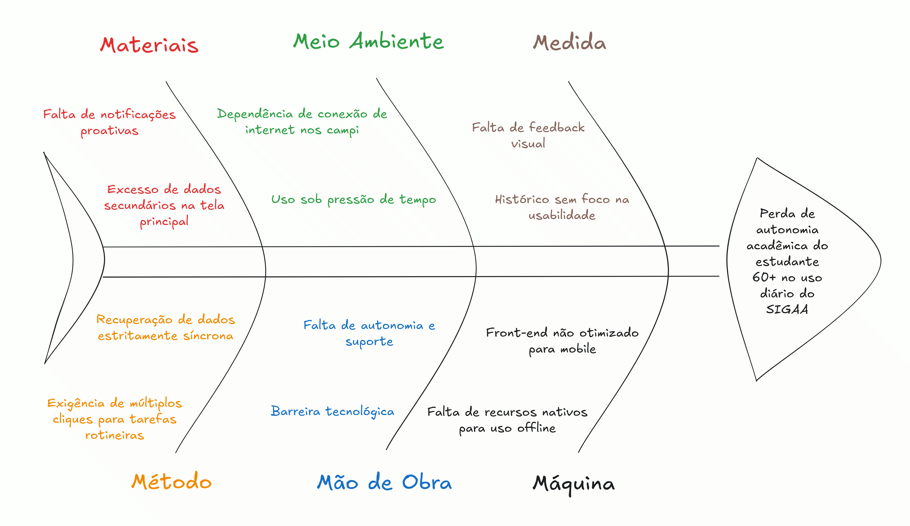

# 1.4 Identificação da Oportunidade ou Problema

A plataforma SIGAA atual apresenta um alto grau de complexidade que cria barreiras críticas de acesso, impactando fortemente os ingressantes do vestibular 60+. O problema central ultrapassa as questões de design visual; ele reside na ausência de funcionalidades práticas que garantam a independência desses alunos no dia a dia. A fim de compreender as causas e raízes dessa perda de autonomia acadêmica dos estudantes 60+ no uso diário do SIGAA, estruturamos o problema utilizando o Diagrama de Ishikawa dos 6M's.

No que tange aos Materiais, o usuário sofre com o excesso de dados secundários na tela principal, o que gera confusão. Isso é agravado pela falta de notificações proativas, obrigando o aluno idoso a lembrar e buscar ativamente informações sobre aulas e prazos. O Meio Ambiente físico e digital impõe desafios como a dependência de conexão de internet nos campi e o uso do sistema sob pressão de tempo (como tentar acessar a carteirinha na catraca do RU ou procurar a sala minutos antes da aula).

Já o aspecto de Medida revela um histórico de desenvolvimento sem foco na usabilidade e uma frequente falta de feedback visual claro após as interações do usuário. Em relação ao Método, o aluno é penalizado por uma recuperação de dados estritamente síncrona e pela exigência de múltiplos cliques para concluir tarefas rotineiras.

Analisando a Mão de Obra, observa-se um atrito entre a barreira tecnológica inerente a muitos usuários da faixa etária 60+ e a grave falta de autonomia e suporte por parte do sistema. Por fim, no aspecto tecnológico referente à Máquina, a infraestrutura atual entrega um front-end que não é otimizado para o uso mobile e sofre com a falta de recursos nativos para uso offline.

Abaixo segue a figura que representa bem essas causas e problemas encontrados na plataforma SIGAA:

---

## Diagrama de Ishikawa (Causa e Efeito)

