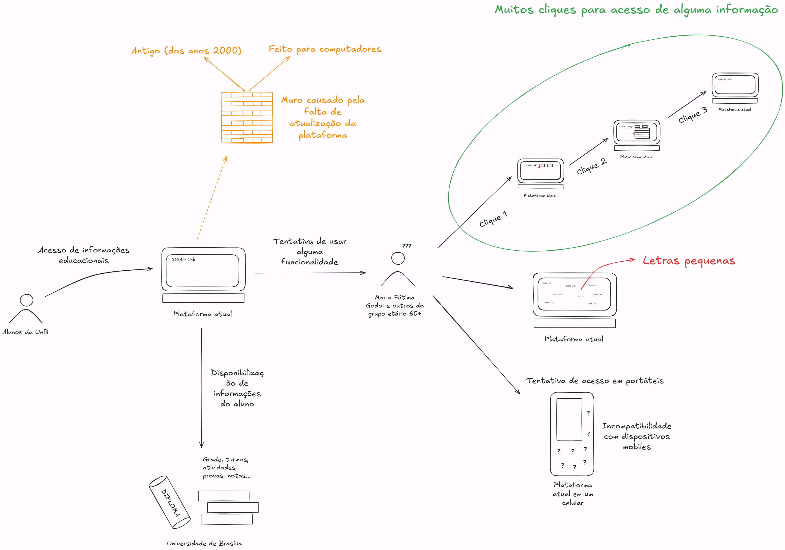

# 1.3 Rich Picture

  <figure class="image-preview__figure">
    
  </figure>
  <a class="image-preview__action" href="../../assets/rich-picture.png" target="_blank" rel="noopener">
    Abrir imagem em tamanho completo
  </a>

**Legenda:**

A Rich Picture ilustra o fluxo atual de interação com o SIGAA, destacando a experiência da representante Maria Fátima e do público 60+ da UnB. O mapeamento visual evidencia que o sistema ainda opera sob uma arquitetura engessada dos anos 2000, desenhada primordialmente para computadores desktop, o que gera barreiras no momento em que os alunos tentam acessar funcionalidades básicas e informações educacionais.

Além do fluxo de uso, o diagrama expõe os principais gargalos relatados pelos usuários durante a pesquisa. Ficam evidentes as deficiências de acessibilidade, como a navegação exaustiva que exige múltiplos cliques, a dificuldade de leitura causada por letras pequenas e a incompatibilidade crítica com dispositivos móveis. Em suma, a representação traduz o desgaste dos alunos gerado pela prolongada falta de atualização tecnológica da plataforma.
