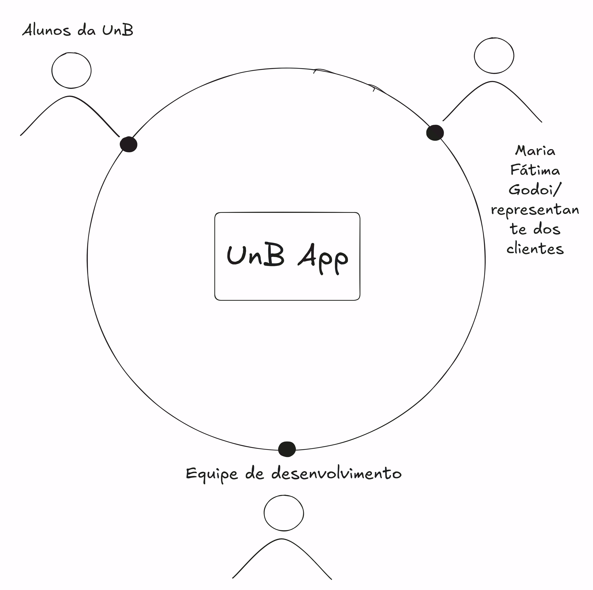

# 1.6 Mapa de Stakeholders

> Identifique os principais stakeholders: quem são, relação com a solução, interesses, expectativas e nível de influência.

---

<!-- Insira o diagrama de stakeholders -->

---

## Quadro-resumo

| Stakeholder | Relação com a solução | Interesse principal | Influência |
|-------------|----------------------|---------------------|------------|
| [Nome]      | [Descrição]          | [Interesse]         | Alta / Média / Baixa |
| [Nome]      | [Descrição]          | [Interesse]         | Alta / Média / Baixa |

!!! tip "Dica"
    Destaque os stakeholders que participam de decisão, validação, uso ou que serão impactados pelo produto.
