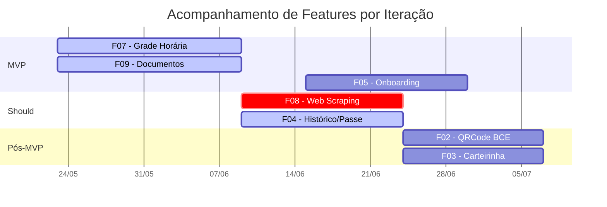
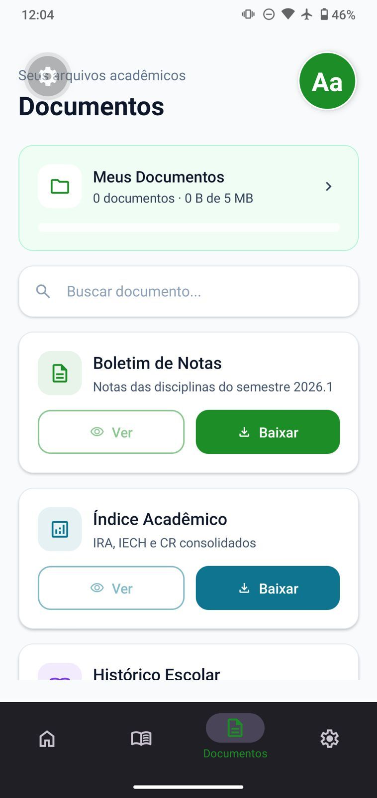
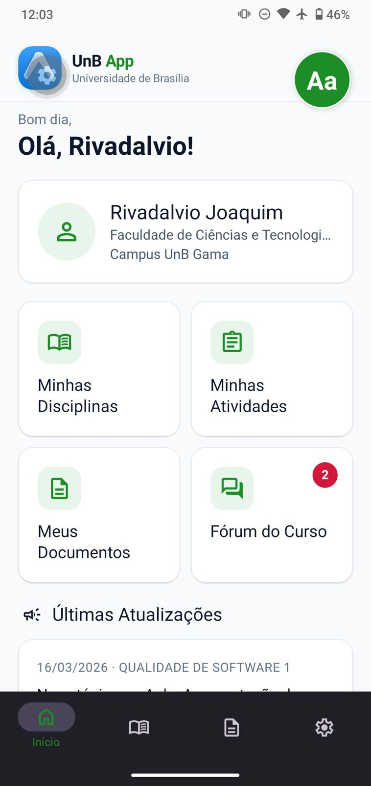

# 6. Cronograma Detalhado (Iterações)

> 📌 **Visão Geral e Rastreabilidade:** A tabela unificada do cronograma com datas, status e responsáveis está na **[Página Inicial (Home)](../index.md)**. Esta página destina-se ao detalhamento profundo de cada iteração, contendo seus Critérios de Aceite, DoR, DoD e Protótipos.

---

## Cronograma × Feature

> Cruzamento entre o cronograma e as features, destacando a entrega do **MVP (F05 + F07 + F09)**.

---

<article class="card" style="border: 1px solid #e2e8f0; border-radius: 8px; padding: 1.5rem; box-shadow: 0 4px 6px -1px rgba(0, 0, 0, 0.1);">
  <h2 style="margin-top: 0;"> ✅ Iteração 1: Documentos e Grade (F09, F07)</h2>
  
  

    <strong>RFs:</strong> <a href="../08-requisitos/funcionais/#rf16">RF16</a>, <a href="../08-requisitos/funcionais/#rf20">RF20</a>, <a href="../08-requisitos/funcionais/#rf21">RF21</a> | <strong>RNFs:</strong> <a href="../08-requisitos/nao-funcionais/#rnf01">RNF01</a>, <a href="../08-requisitos/nao-funcionais/#rnf02">RNF02</a>, <a href="../08-requisitos/nao-funcionais/#rnf03">RNF03</a>, <a href="../08-requisitos/nao-funcionais/#rnf08">RNF08</a>, <a href="../08-requisitos/nao-funcionais/#rnf09">RNF09</a>, <a href="../08-requisitos/nao-funcionais/#rnf14">RNF14</a>, <a href="../08-requisitos/nao-funcionais/#rnf18">RNF18 a RNF26</a> 
    <strong>Data Final:</strong> 08/06/2026 
    <strong>Responsáveis:</strong>
  

  <ul>
    <li>Luís (CP) — UI, navegação, busca, filtros</li>
    <li>Davi (CA) — integração SQLite offline, upload e armazenamento</li>
    <li>Mateus (CO) — suporte técnico</li>
    <li>Pedro (T) — testes funcionais</li>
  </ul>
  
  <h3>Critérios de Aceite</h3>
  <ul>
    <li>O usuário deve conseguir anexar um PDF pelo celular.</li>
    <li>O aplicativo deve processar esse PDF offline.</li>
    <li>A grade horária deve ser renderizada corretamente em formato de calendário.</li>
  </ul>

  <h3>DoR (Definition of Ready)</h3>
  <ul>
    <li>Protótipos de alta fidelidade aprovados.</li>
    <li>ADR-02 (Uso de SQLite) definida e documentada.</li>
  </ul>

  <h3>DoD (Definition of Done)</h3>
  <ul>
    <li>Código no repositório (branch `feat/entregaUnidade3`).</li>
    <li>Testes de parseamento passando.</li>
    <li>App funcional no Expo Go.</li>
  </ul>

  <h3>Protótipos / Evidências</h3>
  

    
    
  

  
🔗 <a href="https://drive.google.com/file/d/1O405tSUfyaiEHS8nvXzuDSnSpt-c87WK/view" target="_blank">Vídeo do Protótipo Funcional</a>

</article>

<article class="card" style="border: 1px solid #e2e8f0; border-radius: 8px; padding: 1.5rem; box-shadow: 0 4px 6px -1px rgba(0, 0, 0, 0.1);">
  <h2 style="margin-top: 0;"> ✅ Iteração 2: Automação e SIGAA (F04, F08)</h2>
  
  

    <strong>RFs:</strong> <a href="../08-requisitos/funcionais/#rf04">RF04, RF05, RF06, RF07</a>, <a href="../08-requisitos/funcionais/#rf17">RF17, RF18, RF19</a> | <strong>RNFs:</strong> <a href="../08-requisitos/nao-funcionais/#rnf03">RNF03</a>, <a href="../08-requisitos/nao-funcionais/#rnf04">RNF04</a>, <a href="../08-requisitos/nao-funcionais/#rnf06">RNF06</a>, <a href="../08-requisitos/nao-funcionais/#rnf08">RNF08</a>, <a href="../08-requisitos/nao-funcionais/#rnf13">RNF13</a>, <a href="../08-requisitos/nao-funcionais/#rnf14">RNF14</a>, <a href="../08-requisitos/nao-funcionais/#rnf17">RNF17</a>, <a href="../08-requisitos/nao-funcionais/#rnf18">RNF18 a RNF26</a> 
    <strong>Data Final:</strong> 24/06/2026 
    <strong>Responsáveis:</strong>
  

  <ul>
    <li>Davi (CP/CA) — parser e arquitetura, web scraping SIGAA</li>
    <li>Mateus (CO) — apoio técnico</li>
    <li>Pedro e Isaac (T) — testes</li>
  </ul>
  
  <h3>Critérios de Aceite</h3>
  <ul>
    <li>Dados do SIGAA devem ser extraídos ou mockados com sucesso.</li>
    <li>O parser do Passe Livre Estudantil deve funcionar com 90% de precisão.</li>
  </ul>

  <h3>DoR (Definition of Ready)</h3>
  <ul>
    <li>Credenciais de homologação do SIGAA disponibilizadas (Bloqueio atual).</li>
    <li>Regex do Passe Livre homologado.</li>
  </ul>

  <h3>DoD (Definition of Done)</h3>
  <ul>
    <li>Notificações em background testadas no celular físico.</li>
    <li>Atualizações do calendário ocorrendo sem quebrar a UI.</li>
  </ul>

  <h3>Protótipos / Evidências</h3>
  
<em>Todas as tarefas relacionadas às funcionalidades F04 e F08 foram concluídas e integradas com sucesso.</em>

</article>

<article class="card" style="border: 1px solid #e2e8f0; border-radius: 8px; padding: 1.5rem; box-shadow: 0 4px 6px -1px rgba(0, 0, 0, 0.1);">
  <h2 style="margin-top: 0;"> 🟡 Iteração 3: Onboarding e Carteirinha (F05, F02, F03)</h2>

  

    <strong>RFs:</strong> <a href="../08-requisitos/funcionais/#rf01">RF01</a>, <a href="../08-requisitos/funcionais/#rf02">RF02</a>, <a href="../08-requisitos/funcionais/#rf03">RF03</a>, <a href="../08-requisitos/funcionais/#rf22">RF22</a>, <a href="../08-requisitos/funcionais/#rf23">RF23</a> | <strong>RNFs:</strong> <a href="../08-requisitos/nao-funcionais/#rnf01">RNF01, RNF02, RNF03</a>, <a href="../08-requisitos/nao-funcionais/#rnf08">RNF08</a>, <a href="../08-requisitos/nao-funcionais/#rnf10">RNF10 a RNF12</a>, <a href="../08-requisitos/nao-funcionais/#rnf18">RNF18 a RNF26</a> 
    <strong>Data Final:</strong> 07/07/2026 
    <strong>Responsáveis:</strong>
  

  <ul>
    <li>Luís (CP/DE) — implementação e copy, geração e renderização, UI</li>
    <li>Davi (CA) — persistência offline</li>
    <li>Pedro e Isaac (T) — testes e verificação de acessibilidade (checklist)</li>
  </ul>

  <h3>Critérios de Aceite</h3>
  <ul>
    <li>Novos usuários devem ver o slider educativo antes da Home.</li>
    <li>Telas de tutorial não devem ser mostradas novamente no segundo acesso.</li>
    <li>QR Code gerado offline deve ser aceito nas catracas da BCE.</li>
    <li>Foto e dados do aluno devem aparecer nítidos na tela.</li>
  </ul>

  <h3>DoR (Definition of Ready)</h3>
  <ul>
    <li>Copy (textos) dos tutoriais escritos e validados com a equipe de usabilidade (60+).</li>
    <li>Assets visuais e ícones exportados em SVG.</li>
    <li>Padrão de criptografia do QR Code da UnB documentado.</li>
    <li>Foto do usuário disponível localmente no cache do SQLite.</li>
  </ul>

  <h3>DoD (Definition of Done)</h3>
  <ul>
    <li>Animações nativas rodando a 60fps constantes.</li>
    <li>Critérios WCAG 2.1 AA atendidos (contraste e foco).</li>
    <li>Acesso físico simulado ou testado na BCE.</li>
    <li>Layout responsivo garantido para telas menores.</li>
  </ul>

  <h3>Protótipos / Evidências</h3>
  
  
🔗 <a href="https://drive.google.com/file/d/1J5pvcoWDN1ZcXoa7kzQK8vBnkqCwdqLL/view" target="_blank">Vídeo de Navegação Inicial</a>

  
<em>Carteirinha/QRCode: branches em andamento. Protótipos em fase final de validação visual.</em>

</article>