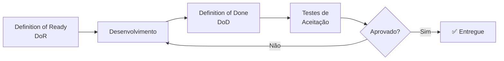

# 6.3 Processo de Validação

> Como a solução do UnB App será validada ao longo do desenvolvimento e antes da entrega final.

---

## Visão geral

O processo de validação da solução do UnB App será conduzido em três etapas principais, com foco em acessibilidade, usabilidade e aderência às necessidades do público-alvo 60+.

---

## Etapas de validação

---

### 1. Definition of Ready (DoR)
Antes do desenvolvimento de cada funcionalidade, será aplicado o DoR para garantir que os requisitos estejam claros, completos e viáveis. Veja os critérios detalhados em [8.1 DoR](../08-dor-dod/dor.md).

Nesta etapa, os critérios de aceitação devem estar bem definidos e alinhados às necessidades dos estudantes idosos, com atenção especial a:

- tamanho de fonte adequado;
- contraste e legibilidade;
- simplicidade de navegação;
- clareza das interações e dos fluxos.

### 2. Definition of Done (DoD)
Durante o desenvolvimento, cada funcionalidade só será considerada concluída após cumprir o DoD. Veja os critérios detalhados em [8.2 DoD](../08-dor-dod/dod.md).

Além da validação funcional pela equipe, a conclusão exige:

- testes unitários e de integração aprovados;
- testes de usabilidade com foco em acessibilidade;
- verificação de execução intuitiva das ações essenciais, como consulta de disciplinas, acesso a informações acadêmicas e recebimento de alertas.

### 3. Testes de aceitação com usuários reais
Após a validação interna, as funcionalidades serão submetidas a testes de aceitação com usuários reais, preferencialmente estudantes da UnB do público 60+.

Nessa etapa, serão coletados feedbacks sobre:

- facilidade de uso;
- compreensão da interface;
- autonomia na realização de tarefas.

Os feedbacks coletados orientarão ajustes contínuos do produto ao longo das sprints.

---

## Validação preliminar com protótipos

Protótipos de interface também serão utilizados para validação preliminar, permitindo identificar problemas de usabilidade antes da implementação.

Cada funcionalidade será validada com base nos critérios de aceitação definidos no DoR, garantindo consistência entre o que foi planejado e o que foi entregue.
