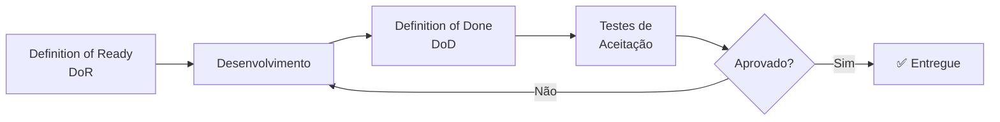

# 6.3 Processo de Validação

> Como o produto será validado antes de sua implementação final.

---

## Etapas de validação

---

### 1. Definition of Ready (DoR)
Verificação antes de iniciar o desenvolvimento de uma funcionalidade. Veja os critérios detalhados em [8.1 DoR](../08-dor-dod/dor.md).

### 2. Definition of Done (DoD)
A funcionalidade é considerada pronta somente após cumprir todos os critérios. Veja os critérios detalhados em [8.2 DoD](../08-dor-dod/dod.md).

### 3. Testes de aceitação com o cliente
Após validação interna, o produto é entregue ao cliente para testes com base nos critérios de aceitação definidos no DoR.
