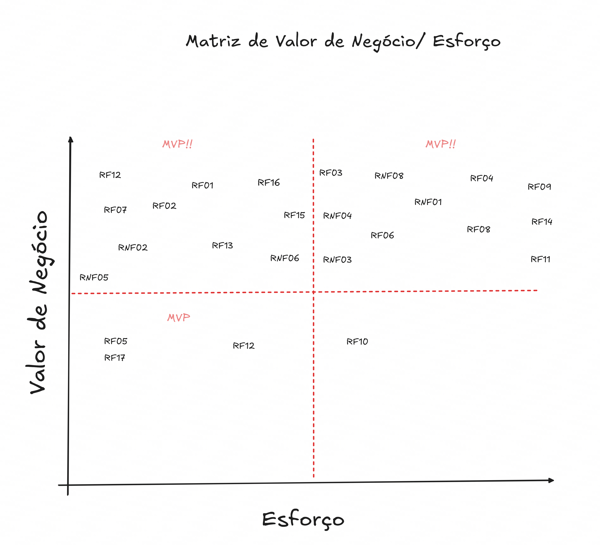

# 10.2 Priorização do Backlog e MVP

## Matriz de Valor de Negócio x Esforço

## Critérios de priorização

> A priorização é baseada no **Valor de Negócio (VB)** e no **Esforço (ES)**.

---

### Valor de Negócio (VB)

O Valor de Negócio é definido com base na quantidade de vezes que a funcionalidade foi solicitada:
- **Formulário do público:** O peso equivale ao número de pedidos (Ex.: pediu 1 vez = peso 1, pediu 3 vezes = peso 3).
- **Cliente:** Os pedidos feitos diretamente pela cliente possuem **peso 3**, visto que atender às suas necessidades é a principal prioridade da equipe.

### Esforço (ES)

O Esforço indica o tempo estimado em **horas** para a implementação do requisito.
- Valores menores indicam tarefas mais rápidas, enquanto valores maiores indicam maior complexidade.
- Exemplo: Implementar um sistema de notificações pode levar **2h**, mas fazer o *web scraping* de um site pode demandar **30h**.

---

### Fórmulas

$$
\text{Pontuação} = \frac{VB}{ES}
$$

> O relacionamento para priorização se dá pela divisão do Valor de Negócio (VB) pelas horas de Esforço (ES), estabelecendo uma relação de Retorno sobre Investimento (ROI). Onde pontuações maiores indicam itens de maior prioridade.

---

## Metodologias de Priorização

A classificação do *Backlog* utiliza a união entre **MoSCoW** (para medir a indispensabilidade) e a **Matriz de Valor x Esforço** (para determinar a viabilidade e sequência de ataque). 

### 1. MoSCoW
* **Must Have:** Mínimo Viável; indispensável para o software funcionar (MVP) e entregar seu valor principal.
* **Should Have:** Importante e de alto valor, mas existem soluções de contorno se não for implementado agora.
* **Could Have:** Desejável sob condições favoráveis, mas pode ser deixado de fora se o tempo for curto.
* **Won't Have:** Fora do escopo para este momento ou release atual.

### 2. Quadrantes da Matriz
Os requisitos pontuados são alocados visualmente na Matriz de Priorização identificando as seguintes decisões baseadas no relacionamento VB x ES:

  
🟢 <strong>Q1 | Ganhos Rápidos</strong>: Alto Valor, Baixo Esforço → Foco central.

  
🔵 <strong>Q2 | Grandes Projetos</strong>: Alto Valor, Alto Esforço → Planeje com cautela.

  
🟡 <strong>Q3 | Tarefas Menores</strong>: Baixo Valor, Baixo Esforço → Prioridade média-baixa.

  
🔴 <strong>Q4 | Demandas Ingratas</strong>: Baixo Valor, Alto Esforço → Evite / Descarte.

---

## Tabela Consolidada de Priorização

| Feature | Nome da Feature | MoSCoW | VB (Peso) | ES (Horas) | Pontuação | Quadrante |
|----|-----------|:------:|:--:|:--:|:--:|:---:|
| F02 | Exibir QRCode da BCE | Must | 9 | 2 | 4.5 | Q1 |
| F03 | Exibir e armazenar a carteirinha digital | Must | 9 | 3 | 3.0 | Q1 |
| F07 | Consultar grade horária e ensalamento | Must | 10 | 4 | 2.5 | Q1 |
| F01 | Conversar com assistente | Must | 10 | 10 | 1.0 | Q2 |
| F04 | Extrair, processar e armazenar Histórico Escolar e/ou Passe Livre | Should | 7 | 8 | 0.87 | Q2 |
| F09 | Centralizar documentos oficiais | Should | 6 | 4 | 1.5 | Q3 |
| F08 | Coletar e atualizar dados acadêmicos | Could | 5 | 5 | 1.0 | Q3 |
| F05 | Exibir fluxos de onboarding | Could | 4 | 3 | 1.33 | Q3 |
| F06 | Listar e reproduzir tutoriais | Won't | 3 | 6 | 0.5 | Q4 |

---

## MVP — Produto Mínimo Viável

> Conjunto mínimo de funcionalidades estritamente necessárias (*Must Have*, primariamente em Q1/Q2) para lançamento e validação contínua de hipóteses com o público.

!!! success "Compõem o MVP"
    - **F02** — Exibir QRCode da BCE
    - **F03** — Exibir e armazenar a carteirinha digital
    - **F07** — Consultar grade horária e ensalamento
    - **F01** — Conversar com assistente

!!! warning "Fora do MVP"
    - **F04** — Extrair, processar e armazenar Histórico Escolar e/ou Passe Livre
    - **F09** — Centralizar documentos oficiais
    - **F08** — Coletar e atualizar dados acadêmicos
    - **F05** — Exibir fluxos de onboarding
    - **F06** — Listar e reproduzir tutoriais
