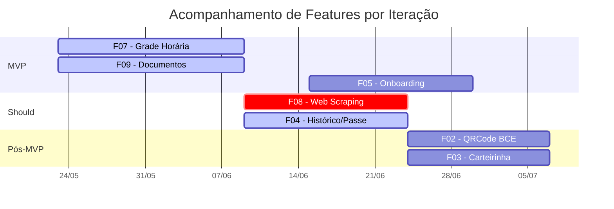

# 10.3 Acompanhamento por Feature (Feature Tracker)

> **Quadro de acompanhamento por feature** no estilo Kanban + FDD, atualizado ao longo do projeto.
>
> Esta página complementa a [Feature List Geral](feature-list-geral.md) e a [Priorização](priorizacao.md) com o **status de execução real** de cada feature: responsável, período de execução, evidências e vínculo ao cronograma.

---

## Legenda de Status

| Ícone | Status | Significado |
|:-----:|--------|-------------|
| ⬜ | **Planejada** | Prevista no cronograma, ainda não iniciada. |
| 🟡 | **Em andamento** | Trabalho ativo na iteração atual. |
| ✅ | **Concluída** | Implementada, validada e integrada. |
| 🔴 | **Pendente/Bloqueada** | Aguardando pré-requisito ou decisão. |
| ❌ | **Fora do escopo** | Não será entregue nesta release (Won't have). |

## Legenda de Papéis FDD

| Sigla | Papel | Quem |
|:-----:|-------|------|
| **CP** | Chief Programmer | Luís / Davi |
| **PM** | Project Manager | Rivaldavio |
| **CA** | Chief Architect | Davi |
| **CO** | Class Owner | Luís / Davi / Mateus / Isaac |
| **DE** | Domain Expert | Luís |
| **TW** | Technical Writer | Luís / Mateus |
| **T** | Tester | Pedro / Mateus / Isaac |

---

## 1. Quadro Consolidado por Feature

> Visão única de todas as features. Cada linha traz o **status atual** e os **links para evidências concretas**.

| # | Feature | RFs | RNFs | MoSCoW | Iteração | Período | Responsáveis (papel) | Status | Evidência Principal |
|:-:|---------|-----|------|:------:|:--------:|---------|------------------------|:------:|---------------------|
| **F01** | Conversar com assistente (IA/Voz) | RF08–RF11 | RNF01, RNF08 | Won't | — | — | — | ❌ | Fora do escopo — VB=2 / ES=60h |
| **F02** | Exibir QRCode da BCE | RF02 | RNF01–RNF03, RNF08 | Could (pós-MVP) | **Iteração 4** | até 07/07/2026 | Luís (CP), Pedro (T) | 🟡 | Branch `feat/qrcode-bce` em desenvolvimento |
| **F03** | Exibir e armazenar a carteirinha digital | RF01, RF03 | RNF02, RNF03, RNF08 | Could (pós-MVP) | **Iteração 4** | até 07/07/2026 | Luís (CP), Davi (CA), Pedro (T) | 🟡 | Branch `feat/carteirinha-digital` em desenvolvimento |
| **F04** | Extrair e processar Histórico/Passe Livre | RF04–RF07 | RNF03, RNF08 | Should | **Iteração 2** | até 24/06/2026 | Davi (CP/CA), Mateus (CO), Pedro (T) | 🟡 | RF06 ✅ concluído (parser); RF04/RF05/RF07 ⬜ |
| **F05** | Exibir fluxos de onboarding | RF22, RF23 | RNF01, RNF02, RNF18–RNF26 | Must (MVP) | **Iteração 3** | até 30/06/2026 | Luís (CP/DE), Isaac (T) | 🟡 | Tela Home implementada; fluxos SIGAA/Aprender 3 ⬜ |
| **F06** | Listar e reproduzir tutoriais | RF12–RF15 | RNF01, RNF02 | Won't | — | — | — | ❌ | Fora do escopo — VB=2 / ES=15h |
| **F07** | Consultar grade horária e ensalamento | RF16 | RNF01, RNF02, RNF03, RNF09, RNF18–RNF26 | Must (MVP) | **Iteração 1** | até 08/06/2026 | Luís (CP), Davi (CA), Pedro (T) | 🟡 | Tela Schedule + parser; [vídeo Upload e Grade](https://drive.google.com/file/d/1O405tSUfyaiEHS8nvXzuDSnSpt-c87WK/view?usp=drive_link) |
| **F08** | Coletar e atualizar dados acadêmicos (Matrícula) | RF17–RF19 | RNF04, RNF06, RNF08, RNF09 | Should | **Iteração 2** | até 24/06/2026 | Davi (CP/CA), Mateus (CO), Isaac (T) | 🔴 | Bloqueada — sem credenciais SIGAA para testes |
| **F09** | Centralizar documentos oficiais | RF20, RF21 | RNF01, RNF02, RNF03, RNF08, RNF18–RNF26 | Must (MVP) | **Iteração 1** | até 08/06/2026 | Luís (CP), Davi (CA), Mateus (CO), Pedro (T) | 🟡 | Upload + SQLite + busca; [vídeo Buscas e Filtros](https://drive.google.com/file/d/1EOVQwvk7PbyRCCIwI105-FQpBcUWR342/view?usp=drive_link) |

---

## 2. Visão Kanban (resumo)

```
┌──────────────────────┬──────────────────────┬──────────────────────┬──────────────────────┐
│   PLANEJADAS (⬜)    │  EM ANDAMENTO (🟡)   │   CONCLUÍDAS (✅)    │  PENDENTES (🔴)      │
├──────────────────────┼──────────────────────┼──────────────────────┼──────────────────────┤
│ F04 — RF04, RF05,    │ F02 — QRCode BCE     │ (nenhuma concluída   │ F08 — Web Scraping   │
│ RF07                 │ F03 — Carteirinha    │  integralmente)      │  SIGAA              │
│ F05 — Onboarding     │ F04 — Histórico      │                      │                      │
│  SIGAA/Aprender 3    │ F05 — Onboarding     │                      │                      │
│                      │  (parcial)           │                      │                      │
│                      │ F07 — Grade Horária  │                      │                      │
│                      │  (parcial)           │                      │                      │
│                      │ F09 — Documentos     │                      │                      │
│                      │  (parcial)           │                      │                      │
└──────────────────────┴──────────────────────┴──────────────────────┴──────────────────────┘
```

---

## 3. Cronograma × Feature

> Cruzamento entre o [cronograma](../06-cronograma/index.md) e as features, destacando a entrega do **MVP (F05 + F07 + F09)**.



---

## 4. Detalhamento por Feature (cards)

> Cada feature recebe um card com **responsáveis, período, subatividades e critério de pronto**.

### F05 · Exibir fluxos de onboarding *(MVP)* 🟡

- **RFs:** RF22, RF23 | **RNFs:** RNF01, RNF02, RNF18–RNF26
- **Iteração:** 3 (até **30/06/2026**)
- **Responsáveis:**
  - Luís (CP/DE) — implementação e copy
  - Isaac (T) — verificação de acessibilidade (checklist)
- **Subatividades:**
  - [x] Splash Screen configurada
  - [x] Tela inicial implementada com exemplos
  - [ ] Fluxo de onboarding SIGAA (RF22)
  - [ ] Fluxo de onboarding Aprender 3 (RF23)
  - [ ] Inspeção visual com usuária 60+
- **Evidências:** [tela-inicial.png](../../assets/evidencias/tela-inicial.png); captura em `UnB-App/src/screens/Home*`
- **Critério de pronto:** Ambos os fluxos (SIGAA + Aprender 3) passam pelo [checklist de acessibilidade](../08-requisitos/checklist-acessibilidade.md) e são demonstrados para a cliente.

---

### F07 · Consultar grade horária e ensalamento *(MVP)* 🟡

- **RFs:** RF16 | **RNFs:** RNF01, RNF02, RNF03, RNF09, RNF18–RNF26
- **Iteração:** 1 (até **08/06/2026** — leve atraso de 2 dias)
- **Responsáveis:**
  - Luís (CP) — UI, navegação em ≤ 2 cliques
  - Davi (CA) — integração SQLite offline
  - Pedro (T) — testes funcionais
- **Subatividades:**
  - [x] Tela Home/Disciplinas (RF16)
  - [x] Parser do histórico em PDF (parcial)
  - [x] Cache local SQLite
  - [ ] Sincronização com calendário acadêmico
  - [ ] Notificação de alteração de horário/sala (RNF09)
- **Evidências:** [Vídeo Upload e Grade](https://drive.google.com/file/d/1O405tSUfyaiEHS8nvXzuDSnSpt-c87WK/view?usp=drive_link)
- **Critério de pronto:** Consulta 100% offline + checklist de acessibilidade aprovado.

---

### F09 · Centralizar documentos oficiais *(MVP)* 🟡

- **RFs:** RF20, RF21 | **RNFs:** RNF01, RNF02, RNF03, RNF08, RNF18–RNF26
- **Iteração:** 1 (até **08/06/2026**)
- **Responsáveis:**
  - Luís (CP) — UI, busca, filtros
  - Davi (CA) — upload e armazenamento
  - Mateus (CO) — suporte técnico
  - Pedro (T) — testes
- **Subatividades:**
  - [x] Upload de PDF (RF20)
  - [x] Armazenamento local (RF21)
  - [x] Busca textual
  - [x] Filtros por tipo/data
  - [ ] Testes unitários do parser
  - [ ] Validação com usuária 60+
- **Evidências:** [Vídeo Buscas e Filtros](https://drive.google.com/file/d/1EOVQwvk7PbyRCCIwI105-FQpBcUWR342/view?usp=drive_link); [tela-documentos.png](../../assets/evidencias/tela-documentos.png)
- **Critério de pronto:** Upload + busca + checklist de acessibilidade aprovados.

---

### F04 · Extrair e processar Histórico/Passe Livre *(Should)* 🟡

- **RFs:** RF04–RF07 | **RNFs:** RNF03, RNF08
- **Iteração:** 2 (até **24/06/2026**)
- **Responsáveis:**
  - Davi (CP/CA) — parser e arquitetura
  - Mateus (CO) — apoio técnico
  - Pedro (T) — testes
- **Subatividades:**
  - [x] RF06 — Parser do Histórico Escolar
  - [ ] RF04 — Persistência dos dados extraídos
  - [ ] RF05 — Processamento genérico de documentos
  - [ ] RF07 — Parser do Passe Livre
- **Evidências:** RF06 commitado; demais pendentes.
- **Critério de pronto:** Dados do histórico e do passe livre extraídos automaticamente e salvos no SQLite local.

---

### F08 · Coletar e atualizar dados acadêmicos — Matrícula *(Should)* 🔴

- **RFs:** RF17, RF18, RF19 | **RNFs:** RNF04, RNF06, RNF08, RNF09
- **Iteração:** 2 (até **24/06/2026**)
- **Responsáveis:**
  - Davi (CP/CA) — web scraping SIGAA
  - Mateus (CO) — apoio
  - Isaac (T) — testes
- **Subatividades:**
  - [ ] RF17 — Coleta diária SIGAA
  - [ ] RF18 — Coleta semanal do calendário
  - [ ] RF19 — Atualização de matrícula
  - [ ] RNF09 — Notificações proativas
- **Bloqueio:** Sem credenciais de homologação do SIGAA para testes.
- **Plano de mitigação:** Solicitar credenciais à cliente ou mockar dados com `MSW`/fixture para destravar o desenvolvimento.
- **Critério de pronto:** Dados de matrícula sincronizados do SIGAA com atualização em ≤ 24h.

---

### F02 · Exibir QRCode da BCE *(pós-MVP)* 🟡

- **RFs:** RF02 | **RNFs:** RNF01–RNF03, RNF08, RNF18–RNF26
- **Iteração:** 4 (até **07/07/2026**)
- **Responsáveis:**
  - Luís (CP) — geração e renderização
  - Pedro (T) — testes
- **Subatividades:**
  - [ ] Geração do QR a partir do CPF
  - [ ] Renderização com tamanho ajustável
  - [ ] Suporte offline via cache da imagem
  - [ ] Inspeção de acessibilidade (rótulo textual, contraste)
- **Evidências:** Branch em desenvolvimento.
- **Critério de pronto:** QR code legível por catraca da BCE + aprovado no checklist.

---

### F03 · Exibir e armazenar a carteirinha digital *(pós-MVP)* 🟡

- **RFs:** RF01, RF03 | **RNFs:** RNF02, RNF03, RNF08, RNF18–RNF26
- **Iteração:** 4 (até **07/07/2026**)
- **Responsáveis:**
  - Luís (CP) — UI
  - Davi (CA) — persistência offline
  - Pedro (T) — testes
- **Subatividades:**
  - [ ] Renderização da carteirinha (foto, nome, matrícula)
  - [ ] Armazenamento local para acesso offline
  - [ ] Suporte a leitor de catraca (NFC/QR)
  - [ ] Validação com usuário 60+
- **Evidências:** Branch em desenvolvimento.
- **Critério de pronto:** Carteirinha funcional offline + leitura por catraca validada.

---

## 5. Resumo Executivo

| Métrica | Valor |
|---------|:-----:|
| Features totais | 9 |
| Features no MVP | 3 (F05, F07, F09) |
| Features pós-MVP | 2 (F02, F03) |
| Features Should | 2 (F04, F08) |
| Features Won't (fora do escopo) | 2 (F01, F06) |
| ✅ Concluídas | 0 integrais (parciais em todas as MVP) |
| 🟡 Em andamento | 5 (F02, F03, F04, F05, F07, F09)* |
| 🔴 Pendentes/Bloqueadas | 1 (F08) |
| ❌ Fora do escopo | 2 (F01, F06) |

> \* F04, F05, F07 e F09 têm subatividades concluídas e outras em andamento; nenhuma feature está totalmente concluída.

---

## 6. Como atualizar esta página

Esta página é **viva** e deve ser revisada:

1. Ao final de cada **iteração quinzenal**.
2. Em toda **reunião de planning** ou **review** do FDD.
3. Após cada **Code Review / Inspeção** de PR relevante.

**Checklist de atualização:**

- [ ] Atualizar coluna **Status** de cada feature afetada.
- [ ] Mover subatividade concluída para `[x]` no card da feature.
- [ ] Adicionar nova evidência (PR, vídeo, commit) na linha correspondente.
- [ ] Atualizar o **Resumo Executivo** (totais por status).
- [ ] Se uma feature mudar de escopo/cancelar, atualizar o status para ❌ com justificativa.
- [ ] Mencionar a atualização na ata da reunião da iteração.