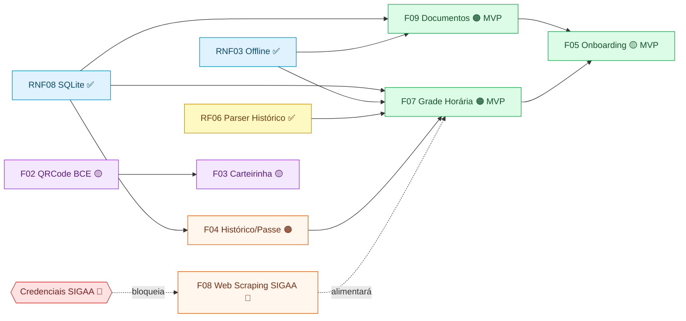

# 10.1 Feature List Geral (Backlog Instrumentado)

> A **Feature List** é o **backlog vivo do projeto** e funciona como instrumento central de **acompanhamento**. Cada feature é derivada dos Requisitos Funcionais e adota a declaração padrão do FDD: **`[ação] [resultado] [objetivo]`**.
>
> 📌 **Esta página foi ampliada** para funcionar também como **backlog instrumentado**: além da descrição, cada feature traz agora **status**, **responsáveis**, **iteração prevista**, **evidência** e **dependências** — permitindo rastreabilidade direta entre Feature, Cronograma, Requisitos e Execução.
>
> 🔗 Páginas relacionadas: [Cronograma](../06-cronograma/index.md) · [Acompanhamento por Feature](acompanhamento.md) · [Priorização e MVP](priorizacao.md) · [Requisitos Funcionais (8.1)](../08-requisitos/funcionais.md) · [Tela de Evidências de Execução (5.3)](../05-er/evidencias-execucao.md) · [Tela de Evidências da Implementação (0.3)](../00-reunioes/evidencias.md)

---

## 1. Legenda de Status

> Status oficiais usados no backlog e em todas as páginas correlatas (cronograma, requisitos, evidências).

| Ícone | Categoria | Significado |
|:-----:|-----------|-------------|
| ⬜ | **Planejado** | Previsto no cronograma, ainda não iniciado. |
| 🟡 | **Em andamento** | Trabalho ativo na iteração corrente. |
| ✅ | **Concluído** | Finalizado, validado e com evidência anexada. |
| 🟠 | **Parcial** | Iniciado, mas apenas parte das subatividades/entregas foi concluída. |
| 🔴 | **Atrasado** | Não concluído no prazo original, com replanejamento documentado. |
| ❌ | **Cancelado** | Descartado por decisão formal (Won't have), com justificativa registrada. |

### Papéis FDD

| Sigla | Papel |
|:-----:|-------|
| **CP** | Chief Programmer |
| **PM** | Project Manager |
| **CA** | Chief Architect |
| **CO** | Class Owner |
| **DE** | Domain Expert |
| **TW** | Technical Writer |
| **T** | Tester |

### Equipe do Projeto

| Membro | Papel(éis) FDD |
|--------|---------------|
| Luís | Chief Programmer (CP), Domain Expert (DE), Technical Writer (TW) |
| Davi | Chief Architect (CA), Chief Programmer (CP) |
| Rivaldavio | Project Manager (PM) |
| Mateus | Class Owner (CO), Technical Writer (TW), Tester (T) |
| Isaac | Tester (T) |
| Pedro | Tester (T) |

---

## 2. Backlog Geral — Tabela Consolidada (Feature List como Instrumento de Acompanhamento)

> Tabela única do backlog com **todas as features** e seus atributos de rastreamento. Use os links da coluna **Evidência** para abrir diretamente a tela de evidências da feature correspondente.

| # | Feature | MoSCoW | Iteração Planejada | Período | Status | Responsáveis (papel) | Dependências | Evidência Principal |
|:-:|---------|:------:|:------------------:|---------|:------:|----------------------|--------------|---------------------|
| **F09** | Centralizar documentos oficiais | **Must (MVP)** | **I1** | até 08/06/2026 | 🟠 Parcial | Luís (CP), Davi (CA), Mateus (CO), Pedro (T) | RNF08 (SQLite), RNF03 (Offline) | [Vídeo Upload e Grade](https://drive.google.com/file/d/1O405tSUfyaiEHS8nvXzuDSnSpt-c87WK/view?usp=drive_link) · [Vídeo Buscas e Filtros](https://drive.google.com/file/d/1EOVQwvk7PbyRCCIwI105-FQpBcUWR342/view?usp=drive_link) · [tela-documentos.png](../../assets/evidencias/tela-documentos.png) · [5.3 §2.5 F09](../05-er/evidencias-execucao.md) |
| **F05** | Exibir fluxos de onboarding | **Must (MVP)** | **I3** (Splash+Home antecipada p/ I1) | até 30/06/2026 | 🟡 Em andamento | Luís (CP/DE), Isaac (T) | RF20/RF21 (F09), RF16 (F07), RNF01, RNF02, RNF18–RNF26 | [tela-inicial.png](../../assets/evidencias/tela-inicial.png) · [Vídeo Tela Inicial](https://drive.google.com/file/d/1J5pvcoWDN1ZcXoa7kzQK8vBnkqCwdqLL/view?usp=drive_link) · [5.3 §2.4 F05](../05-er/evidencias-execucao.md) |
| **F07** | Consultar grade horária e ensalamento | **Must (MVP)** | **I1** | até 08/06/2026 (+2 dias) | 🟠 Parcial | Luís (CP), Davi (CA), Pedro (T) | RF06 (F04 — parser), RNF08 (SQLite), RNF03 (Offline) | [Vídeo Upload e Grade](https://drive.google.com/file/d/1O405tSUfyaiEHS8nvXzuDSnSpt-c87WK/view?usp=drive_link) · [tela-inicial.png](../../assets/evidencias/tela-inicial.png) · [5.3 §2.5 F07](../05-er/evidencias-execucao.md) |
| **F04** | Extrair e processar Histórico Escolar e/ou Passe Livre | **Should** | **I2** (RF06 antecipado p/ I1) | até 24/06/2026 | 🟠 Parcial | Davi (CP/CA), Mateus (CO), Pedro (T) | RNF08 (SQLite), RNF03 (Offline); saída alimenta F07 | [5.3 §2.5 F04 RF06](../05-er/evidencias-execucao.md) · [10.3 F04 card](acompanhamento.md) |
| **F08** | Coletar e atualizar dados acadêmicos (Matrícula) | **Should** | **I2** | até 24/06/2026 | 🔴 Atrasado (bloqueada) | Davi (CP/CA), Mateus (CO), Isaac (T) | Credenciais SIGAA de homologação; alimenta F07 (grade) e RNF09 (notificações) | [5.3 §5 Pendência F08](../05-er/evidencias-execucao.md) |
| **F02** | Exibir QRCode da BCE | **Could (pós-MVP)** | **I4** | até 07/07/2026 | 🟡 Em andamento | Luís (CP), Pedro (T) | RNF08 (cache da imagem), RNF03 (Offline) | [10.3 F02 card](acompanhamento.md) · [5.3 §2.5 F02](../05-er/evidencias-execucao.md) |
| **F03** | Exibir e armazenar a carteirinha digital | **Could (pós-MVP)** | **I4** | até 07/07/2026 | 🟡 Em andamento | Luís (CP), Davi (CA), Pedro (T) | RNF08 (SQLite), RNF03 (Offline); NFC/QR compartilhado com F02 | [10.3 F03 card](acompanhamento.md) · [5.3 §2.5 F03](../05-er/evidencias-execucao.md) |
| **F06** | Listar e reproduzir tutoriais | **Won't** | — | — | ❌ Cancelado | — | — | Fora do escopo (VB=2 / ES=15h) |
| **F01** | Conversar com assistente (IA/Voz) | **Won't** | — | — | ❌ Cancelado | — | — | Fora do escopo (VB=2 / ES=60h) |

### Legenda da coluna **Dependências**

- **RNF** listado = requisito não funcional que precisa estar satisfeito.
- **RF** listado = requisito/feature predecessora.
- **Recurso externo** = credencial, serviço ou insumo de terceiros necessário.
- **Saída alimenta…** = feature que consome o resultado desta.

---

## 3. Cards por Feature (Detalhamento)

> Cada feature recebe um card com descrição no padrão FDD, **rastreabilidade completa**, **status, responsáveis, iteração, evidências e dependências**.

---

### F09 · Centralizar documentos oficiais *(MVP)* 🟠

- **Ação · Resultado · Objetivo:** *Centralizar documentos oficiais, reunindo todos os documentos acadêmicos e estudantis em um único local acessível, facilitando a localização, gestão e apresentação de documentos pelo estudante, economizando tempo e esforço.*
- **RF(s):** RF20, RF21 | **RNF(s):** RNF01, RNF02, RNF03, RNF08, RNF18–RNF26
- **MoSCoW:** Must (MVP) | **Priorização:** VB=22 / ES=12h → 1.83 (Q1)
- **Iteração planejada:** **I1** (até 08/06/2026)
- **Período realizado:** até 10/06/2026 (+2 dias, ver desvio D1 no cronograma)
- **Status atual:** 🟠 Parcial (upload, armazenamento, busca e filtros concluídos; faltam testes unitários do parser e validação com usuária 60+)
- **Responsáveis:**
  - Luís (CP) — UI, busca, filtros
  - Davi (CA) — upload e armazenamento
  - Mateus (CO) — suporte técnico
  - Pedro (T) — testes
- **Dependências (predecessoras):**
  - RNF08 — Armazenamento Local com Expo SQLite (ADR-02) ✅
  - RNF03 — Consulta Offline ✅
- **Saída alimenta:** nenhuma (feature de armazenamento independente)
- **Evidências:**
  - [Vídeo Upload e Grade](https://drive.google.com/file/d/1O405tSUfyaiEHS8nvXzuDSnSpt-c87WK/view?usp=drive_link)
  - [Vídeo Buscas e Filtros](https://drive.google.com/file/d/1EOVQwvk7PbyRCCIwI105-FQpBcUWR342/view?usp=drive_link)
  - [Captura tela-documentos](../../assets/evidencias/tela-documentos.png)
  - [5.3 §2.5 F09](../05-er/evidencias-execucao.md)
  - [Evidências U3 §1](../00-reunioes/evidencias.md)

---

### F05 · Exibir fluxos de onboarding *(MVP)* 🟡

- **Ação · Resultado · Objetivo:** *Exibir fluxos de onboarding, apresentando as principais funcionalidades e a proposta de valor do aplicativo aos novos usuários, garantindo que o usuário compreenda rapidamente como utilizar a plataforma e sinta-se engajado desde o primeiro uso.*
- **RF(s):** RF22, RF23 | **RNF(s):** RNF01, RNF02, RNF18–RNF26
- **MoSCoW:** Must (MVP) | **Priorização:** VB=16 / ES=10h → 1.60 (Q1)
- **Iteração planejada:** **I3** (até 30/06/2026)
- **Período realizado:** em execução (Splash + Home antecipadas na I1; fluxos SIGAA/Aprender 3 ⬜)
- **Status atual:** 🟡 Em andamento
- **Responsáveis:**
  - Luís (CP/DE) — implementação e copy
  - Isaac (T) — verificação de acessibilidade (checklist)
- **Dependências (predecessoras):**
  - RF20/RF21 — F09 concluída para demonstrar valor no onboarding ✅
  - RF16 — F07 concluída para demonstrar grade no onboarding 🟠
  - RNF01, RNF02, RNF18–RNF26 — Design System tipografia/navegação
- **Saída alimenta:** primeira impressão do usuário para todas as demais features
- **Evidências:**
  - [Captura tela-inicial](../../assets/evidencias/tela-inicial.png)
  - [Vídeo Tela Inicial](https://drive.google.com/file/d/1J5pvcoWDN1ZcXoa7kzQK8vBnkqCwdqLL/view?usp=drive_link)
  - [5.3 §2.4 F05](../05-er/evidencias-execucao.md)
  - [checklist-acessibilidade](../08-requisitos/checklist-acessibilidade.md)

---

### F07 · Consultar grade horária e ensalamento *(MVP)* 🟠

- **Ação · Resultado · Objetivo:** *Consultar grade horária e ensalamento, informando as disciplinas, horários e locais de aula mesmo sem internet, reduzindo a sobrecarga cognitiva do usuário na localização de espaços físicos no campus e sem depender de conexões de internet instáveis.*
- **RF(s):** RF16 | **RNF(s):** RNF01, RNF02, RNF03, RNF09, RNF18–RNF26
- **MoSCoW:** Must (MVP) | **Priorização:** VB=9 / ES=16h → 0.56 (Q1 / Q2)
- **Iteração planejada:** **I1** (até 08/06/2026)
- **Período realizado:** até 10/06/2026 (+2 dias, ver desvio D1 no cronograma)
- **Status atual:** 🟠 Parcial (grade + parser entregues; sincronização com calendário e notificação pendentes)
- **Responsáveis:**
  - Luís (CP) — UI, navegação em ≤ 2 cliques
  - Davi (CA) — integração SQLite offline
  - Pedro (T) — testes funcionais
- **Dependências (predecessoras):**
  - RF06 — Parser do Histórico Escolar (F04) ✅
  - RNF08 — Armazenamento Local com SQLite ✅
  - RNF03 — Consulta Offline ✅
- **Saída alimenta:** exibição principal do app (entra no onboarding F05)
- **Evidências:**
  - [Vídeo Upload e Grade](https://drive.google.com/file/d/1O405tSUfyaiEHS8nvXzuDSnSpt-c87WK/view?usp=drive_link)
  - [Captura tela-inicial](../../assets/evidencias/tela-inicial.png)
  - [5.3 §2.5 F07](../05-er/evidencias-execucao.md)
  - [5.3 §2.5 F04 RF06](../05-er/evidencias-execucao.md) — parser

---

### F04 · Extrair e processar Histórico Escolar e/ou Passe Livre *(Should)* 🟠

- **Ação · Resultado · Objetivo:** *Extrair, processar e armazenar Histórico Escolar e/ou Passe Livre Estudantil para obter dados úteis à plataforma de forma automatizada, reduzindo o esforço manual do usuário ao evitar o preenchimento de formulários.*
- **RF(s):** RF04, RF05, RF06, RF07 | **RNF(s):** RNF03, RNF08
- **MoSCoW:** Should | **Priorização:** VB=16 / ES=35h → 0.45 (Q2)
- **Iteração planejada:** **I2** (até 24/06/2026)
- **Período realizado:** RF06 ✅ concluído (antecipado na I1); RF04/RF05/RF07 ⬜
- **Status atual:** 🟠 Parcial
- **Responsáveis:**
  - Davi (CP/CA) — parser e arquitetura
  - Mateus (CO) — apoio técnico
  - Pedro (T) — testes
- **Dependências (predecessoras):**
  - RNF08 — Armazenamento Local com SQLite ✅
  - RNF03 — Consulta Offline ✅
- **Saída alimenta:** **F07** (a grade horária consome os dados extraídos do histórico)
- **Evidências:**
  - [5.3 §2.5 F04 RF06](../05-er/evidencias-execucao.md) — único sub-requisito concluído
  - [10.3 F04 card](acompanhamento.md)

---

### F08 · Coletar e atualizar dados acadêmicos — Matrícula *(Should)* 🔴

- **Ação · Resultado · Objetivo:** *Coletar e atualizar dados acadêmicos, mantendo as informações do usuário sincronizadas e atualizadas no sistema, garantindo a precisão dos dados para acesso a serviços e funcionalidades específicas e evitando retrabalho.*
- **RF(s):** RF17, RF18, RF19 | **RNF(s):** RNF04, RNF06, RNF08, RNF09
- **MoSCoW:** Should | **Priorização:** VB=16 / ES=50h → 0.32 (Q2)
- **Iteração planejada:** **I2** (até 24/06/2026)
- **Período realizado:** não iniciado — **bloqueado**
- **Status atual:** 🔴 Atrasado — bloqueado por falta de credenciais SIGAA de homologação
- **Responsáveis:**
  - Davi (CP/CA) — web scraping SIGAA
  - Mateus (CO) — apoio
  - Isaac (T) — testes
- **Dependências (predecessoras):**
  - **Credenciais SIGAA de homologação** (recurso externo) 🔴 bloqueador
- **Saída alimenta:** **F07** (atualização automática da grade) e **RNF09** (notificações proativas)
- **Plano de mitigação:** solicitar credenciais à cliente ou mockar dados com `MSW`/fixture para destravar o desenvolvimento — registrado em [5.3 §5](../05-er/evidencias-execucao.md)
- **Evidências:**
  - [5.3 §5 Pendência F08](../05-er/evidencias-execucao.md)

---

### F02 · Exibir QRCode da BCE *(pós-MVP)* 🟡

- **Ação · Resultado · Objetivo:** *Exibir QRCode da BCE, gerando e apresentando na tela o QR Code criado a partir do CPF do estudante, para permitir a autenticação e o acesso físico rápido e prático à Biblioteca Central (BCE).*
- **RF(s):** RF02 | **RNF(s):** RNF01, RNF02, RNF03, RNF08, RNF18–RNF26
- **MoSCoW:** Could (pós-MVP) | **Priorização:** VB=3 / ES=8h → 0.37 (Q3)
- **Iteração planejada:** **I4** (até 07/07/2026)
- **Período realizado:** em execução
- **Status atual:** 🟡 Em andamento
- **Responsáveis:**
  - Luís (CP) — geração e renderização
  - Pedro (T) — testes
- **Dependências (predecessoras):**
  - RNF08 — Cache da imagem do QR ✅
  - RNF03 — Funcionamento Offline 🟡
- **Saída alimenta:** nenhuma
- **Evidências:**
  - [10.3 F02 card](acompanhamento.md)
  - [5.3 §2.5 F02](../05-er/evidencias-execucao.md)

---

### F03 · Exibir e armazenar a carteirinha digital *(pós-MVP)* 🟡

- **Ação · Resultado · Objetivo:** *Acessar carteirinha digital, apresentando as credenciais do aluno a qualquer momento a partir do armazenamento local, para garantir a identificação do estudante nos espaços da universidade mesmo sem internet.*
- **RF(s):** RF01, RF03 | **RNF(s):** RNF02, RNF03, RNF08, RNF18–RNF26
- **MoSCoW:** Could (pós-MVP) | **Priorização:** VB=3 / ES=10h → 0.30 (Q3)
- **Iteração planejada:** **I4** (até 07/07/2026)
- **Período realizado:** em execução
- **Status atual:** 🟡 Em andamento
- **Responsáveis:**
  - Luís (CP) — UI
  - Davi (CA) — persistência offline
  - Pedro (T) — testes
- **Dependências (predecessoras):**
  - RNF08 — Armazenamento Local com SQLite ✅
  - RNF03 — Consulta Offline 🟡
- **Saída alimenta:** nenhuma (mas compartilha camada de leitura por catraca com F02)
- **Evidências:**
  - [10.3 F03 card](acompanhamento.md)
  - [5.3 §2.5 F03](../05-er/evidencias-execucao.md)

---

### F06 · Listar e reproduzir tutoriais *(Won't)* ❌

- **Ação · Resultado · Objetivo:** *Listar e reproduzir tutoriais esclarecendo o funcionamento do aplicativo e das plataformas oficiais da universidade (como SIGAA e Aprender 3) através de vídeos e textos, acelerando a curva de aprendizagem tecnológica do usuário e reduzindo tanto o tempo de adaptação quanto a dependência de terceiros.*
- **RF(s):** RF12, RF13, RF14, RF15 | **RNF(s):** RNF01, RNF02
- **MoSCoW:** Won't | **Priorização:** VB=2 / ES=15h → 0.13 (Q4)
- **Iteração planejada:** —
- **Status atual:** ❌ Cancelado (Won't have)
- **Justificativa:** esforço de 15h × VB=2 (Q4 — demandas ingratas) — não será entregue nesta release.
- **Evidências:** decisão registrada em [Priorização e MVP](priorizacao.md).

---

### F01 · Conversar com assistente (IA/Voz) *(Won't)* ❌

- **Ação · Resultado · Objetivo:** *Conversar com assistente para sanar dúvidas usando linguagem natural, diminuindo a ansiedade e estresse causados pela falta de entendimento das plataformas oficiais da Universidade.*
- **RF(s):** RF08, RF09, RF10, RF11 | **RNF(s):** RNF01, RNF08
- **MoSCoW:** Won't | **Priorização:** VB=2 / ES=60h → 0.03 (Q4)
- **Iteração planejada:** —
- **Status atual:** ❌ Cancelado (Won't have)
- **Justificativa:** esforço de 60h × VB=2 (Q4 — demandas ingratas) — não será entregue nesta release.
- **Evidências:** decisão registrada em [Priorização e MVP](priorizacao.md).

---

## 4. Mapa de Dependências entre Features

> Diagrama lógico que mostra **quem depende de quem**. As setas partem da feature **predecessora** (origem) para a feature **sucessora** (destino). Features canceladas são omitidas.

**Leitura do mapa:**

- 🟦 **Infraestrutura:** RNF08 (SQLite) e RNF03 (Offline) sustentam F07, F09 e F04.
- 🟨 **Pré-requisito de parser:** RF06 (dentro de F04) já concluído alimenta F07.
- 🟩 **MVP (Q1/Q2):** F07 + F09 + F05 formam o MVP; F05 depende das duas primeiras para demonstrar valor.
- 🟧 **Should:** F04 alimenta F07; F08 está bloqueada e alimentaria F07 quando liberada.
- 🟪 **Pós-MVP:** F02 ↔ F03 compartilham camada de leitura por catraca.
- 🟥 **Bloqueio externo:** SIGAA bloqueia F08.

---

## 5. Cronograma × Features (Visão Rápida)

> Espelho direto do [Cronograma §2](../06-cronograma/index.md) para garantir rastreabilidade a partir de qualquer página. **Toda página da Feature List aponta para o cronograma e vice-versa.**

| Iteração | Período Planejado | Período Realizado | Features | Status Global |
|:-:|---------|---------|---------|:------:|
| **Fase 0** | 13/04 – 22/05/2026 | 13/04 – 22/05/2026 | F01–F09 (contexto) | ✅ |
| **I1** | até 08/06/2026 | até 10/06/2026 (+2 dias) | **F09** 🟠, **F07** 🟠, RF06 (F04) ✅ antecipado | 🟠 Parcial (c/ atraso) |
| **I2** | até 24/06/2026 | em execução | **F04** 🟠, **F08** 🔴 | 🟡 Em andamento |
| **I3** | até 30/06/2026 | em execução | **F05** 🟡 | 🟡 Em andamento |
| **I4** | até 07/07/2026 | em execução | **F02** 🟡, **F03** 🟡 | 🟡 Em andamento |

🔗 Detalhamento completo em [Cronograma e Entregas](../06-cronograma/index.md).

---

## 6. Resumo Executivo do Backlog

| Categoria | Qtd. | Features |
|:---------:|:----:|----------|
| ⬜ Planejado | 1 | RF04, RF05, RF07 (sub-itens de F04) |
| 🟡 Em andamento | 3 | F02, F03, F05 |
| ✅ Concluído | 0 integrais (parciais em F09, F07) |
| 🟠 Parcial | 3 | F07, F09, F04 |
| 🔴 Atrasado | 1 | F08 |
| ❌ Cancelado | 2 | F01, F06 |

### Por MoSCoW

| MoSCoW | Features | Status agregado |
|:------:|----------|-----------------|
| Must (MVP) | F05, F07, F09 | 2 🟠 / 1 🟡 |
| Should | F04, F08 | 1 🟠 / 1 🔴 |
| Could (pós-MVP) | F02, F03 | 2 🟡 |
| Won't | F01, F06 | 2 ❌ |

---

## 7. Como manter este backlog atualizado

> Esta página é **viva** e deve ser revisada:
>
> 1. Ao final de cada **iteração quinzenal** (alinhada com o [cronograma](../06-cronograma/index.md)).
> 2. Em toda **reunião de planning** ou **review** do FDD.
> 3. Após cada **Code Review / Inspeção** de PR relevante.

**Checklist de atualização por iteração:**

- [ ] Atualizar coluna **Status** das features afetadas.
- [ ] Atualizar coluna **Período** com a data realizada.
- [ ] Subir/baixar feature no fluxo se houver mudança de MoSCoW.
- [ ] Adicionar nova evidência (PR, vídeo, commit, screenshot) na coluna **Evidência**.
- [ ] Atualizar **dependências** (novos predecessores ou sucessores).
- [ ] Atualizar o **Resumo Executivo** (totais por status e MoSCoW).
- [ ] Se uma feature mudar de escopo/cancelar, mover para ❌ com justificativa.
- [ ] **Refletir a atualização no [Cronograma](../06-cronograma/index.md) e no [Acompanhamento por Feature](acompanhamento.md)** — as três páginas devem permanecer sincronizadas.
- [ ] Mencionar a atualização na ata da reunião da iteração.

---

## 8. Links Úteis

- 🗓️ [Cronograma e Entregas](../06-cronograma/index.md)
- 🧭 [Acompanhamento por Feature (10.3)](acompanhamento.md)
- 🎯 [Priorização e MVP (10.2)](priorizacao.md)
- 📊 [Requisitos Funcionais (8.1)](../08-requisitos/funcionais.md)
- ⚙️ [Requisitos Não Funcionais (8.2)](../08-requisitos/nao-funcionais.md)
- 🔗 [Matriz de Rastreabilidade (8.3)](../08-requisitos/rastreabilidade.md)
- 📂 [Tela de Evidências de Execução do FDD (5.3)](../05-er/evidencias-execucao.md)
- 🖼️ [Tela de Evidências da Implementação (0.3)](../00-reunioes/evidencias.md)
- ✅ [DoR e DoD](../09-dor-dod/index.md)
- ♿ [Checklist de Acessibilidade](../08-requisitos/checklist-acessibilidade.md)
- 🗂️ [Repositório GitHub](https://github.com/mdsreq-fga-unb/REQ-2026.1-T02-UnB-App)
- 🎥 [Gravações das Reuniões](../00-reunioes/gravacoes.md)