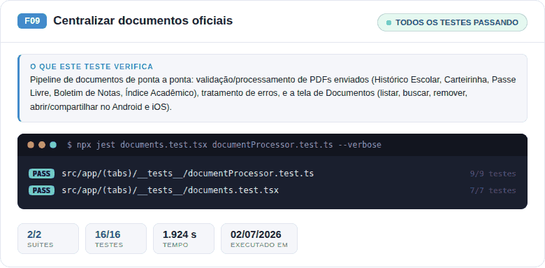
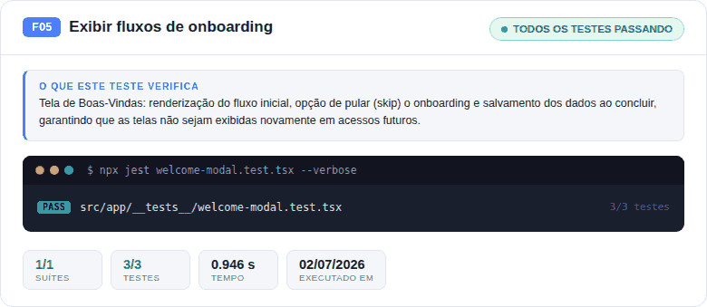
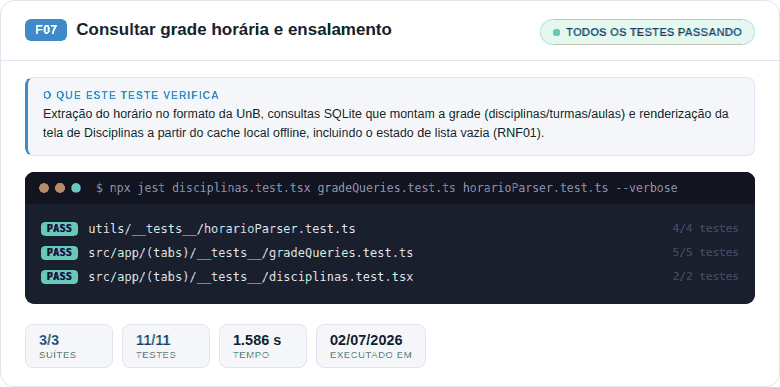
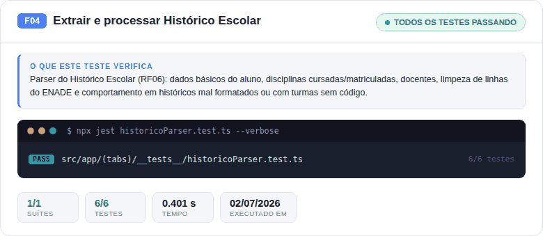
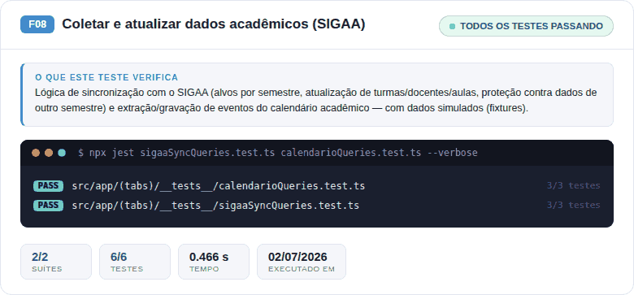

# 10.1 Feature List Geral

> A **Feature List** é o **backlog vivo do projeto** e funciona como instrumento central de acompanhamento.
>
> 📌 **Visão Geral e Rastreabilidade:** O cronograma e a tabela unificada (MVP) estão na **[Página Inicial (Home)](../index.md)**. Esta página destina-se ao detalhamento de cada feature em forma de cards com foco no fluxo e nas evidências.

---

## Legenda de Status

| Ícone | Status | Significado |
|:-----:|--------|-------------|
| ⬜ | **Planejada** | Prevista no cronograma, ainda não iniciada. |
| 🟡 | **Em andamento** | Trabalho ativo na iteração atual. |
| ✅ | **Concluída** | Implementada, validada e integrada. |
| 🔴 | **Pendente/Bloqueada** | Aguardando pré-requisito ou decisão. |
| ❌ | **Fora do escopo** | Não será entregue nesta release (Won't have). |

---

## Legenda de Papéis FDD

| Sigla | Papel | Quem |
|:-----:|-------|------|
| **CP** | Chief Programmer | Luís / Davi |
| **PM** | Project Manager | Rivaldavio |
| **CA** | Chief Architect | Davi |
| **CO** | Class Owner | Luís / Davi / Mateus / Isaac / Pedro |
| **DE** | Domain Expert | Luís |
| **TW** | Technical Writer | Luís / Mateus |
| **T** | Tester | Pedro / Mateus / Isaac |

---

## Quadro Consolidado por Feature

> Visão única de todas as features. Cada linha traz o **status atual** e os **links para evidências concretas**.

| # | Feature | RFs | RNFs | MoSCoW | Iteração | Período | Responsáveis (papel) | Status | Evidência Principal |
|:-:|---------|-----|------|:------:|:--------:|---------|------------------------|:------:|---------------------|
| **F01** | Conversar com assistente (IA/Voz) | [RF08](../08-requisitos/funcionais.md#rf08), [RF09](../08-requisitos/funcionais.md#rf09), [RF10](../08-requisitos/funcionais.md#rf10), [RF11](../08-requisitos/funcionais.md#rf11) | [RNF01](../08-requisitos/nao-funcionais.md#rnf01), [RNF08](../08-requisitos/nao-funcionais.md#rnf08), [RNF18](../08-requisitos/nao-funcionais.md#rnf18) a [RNF26](../08-requisitos/nao-funcionais.md#rnf26) | Won't | — | — | — | ❌ | Fora do escopo — VB=2 / ES=60h |
| **F02** | Exibir QRCode da BCE | [RF02](../08-requisitos/funcionais.md#rf02) | [RNF01](../08-requisitos/nao-funcionais.md#rnf01), [RNF02](../08-requisitos/nao-funcionais.md#rnf02), [RNF03](../08-requisitos/nao-funcionais.md#rnf03), [RNF08](../08-requisitos/nao-funcionais.md#rnf08), [RNF18](../08-requisitos/nao-funcionais.md#rnf18) a [RNF26](../08-requisitos/nao-funcionais.md#rnf26) | Could (pós-MVP) | **Iteração 3** | até 07/07/2026 | Luís (CP), Pedro (T) | 🟡 | Branch `feat/qrcode-bce` em desenvolvimento |
| **F03** | Exibir e armazenar a carteirinha digital | [RF01](../08-requisitos/funcionais.md#rf01), [RF03](../08-requisitos/funcionais.md#rf03) | [RNF02](../08-requisitos/nao-funcionais.md#rnf02), [RNF03](../08-requisitos/nao-funcionais.md#rnf03), [RNF08](../08-requisitos/nao-funcionais.md#rnf08), [RNF18](../08-requisitos/nao-funcionais.md#rnf18) a [RNF26](../08-requisitos/nao-funcionais.md#rnf26) | Could (pós-MVP) | **Iteração 3** | até 07/07/2026 | Luís (CP), Davi (CA), Pedro (T) | 🟡 | Branch `feat/carteirinha-digital` em desenvolvimento |
| **F04** | Extrair e processar Histórico/Passe Livre | [RF04](../08-requisitos/funcionais.md#rf04), [RF05](../08-requisitos/funcionais.md#rf05), [RF06](../08-requisitos/funcionais.md#rf06), [RF07](../08-requisitos/funcionais.md#rf07) | [RNF03](../08-requisitos/nao-funcionais.md#rnf03), [RNF08](../08-requisitos/nao-funcionais.md#rnf08), [RNF13](../08-requisitos/nao-funcionais.md#rnf13), [RNF14](../08-requisitos/nao-funcionais.md#rnf14), [RNF18](../08-requisitos/nao-funcionais.md#rnf18) a [RNF26](../08-requisitos/nao-funcionais.md#rnf26) | Should | **Iteração 2** | até 24/06/2026 | Davi (CP/CA), Mateus (CO), Pedro (T) | 🟡 | RF06 ✅ concluído (parser); RF04/RF05/RF07 ⬜ |
| **F05** | Exibir fluxos de onboarding | [RF22](../08-requisitos/funcionais.md#rf22), [RF23](../08-requisitos/funcionais.md#rf23) | [RNF01](../08-requisitos/nao-funcionais.md#rnf01), [RNF02](../08-requisitos/nao-funcionais.md#rnf02), [RNF10](../08-requisitos/nao-funcionais.md#rnf10) a [RNF12](../08-requisitos/nao-funcionais.md#rnf12), [RNF18](../08-requisitos/nao-funcionais.md#rnf18) a [RNF26](../08-requisitos/nao-funcionais.md#rnf26) | Must (MVP) | **Iteração 3** | até 30/06/2026 | Luís (CP/DE), Isaac (T) | 🟡 | Tela Home implementada; fluxos SIGAA/Aprender 3 ⬜ |
| **F06** | Listar e reproduzir tutoriais | [RF12](../08-requisitos/funcionais.md#rf12), [RF13](../08-requisitos/funcionais.md#rf13), [RF14](../08-requisitos/funcionais.md#rf14), [RF15](../08-requisitos/funcionais.md#rf15) | [RNF01](../08-requisitos/nao-funcionais.md#rnf01), [RNF02](../08-requisitos/nao-funcionais.md#rnf02), [RNF18](../08-requisitos/nao-funcionais.md#rnf18) a [RNF26](../08-requisitos/nao-funcionais.md#rnf26) | Won't | — | — | — | ❌ | Fora do escopo — VB=2 / ES=15h |
| **F07** | Consultar grade horária e ensalamento | [RF16](../08-requisitos/funcionais.md#rf16) | [RNF01](../08-requisitos/nao-funcionais.md#rnf01), [RNF02](../08-requisitos/nao-funcionais.md#rnf02), [RNF03](../08-requisitos/nao-funcionais.md#rnf03), [RNF09](../08-requisitos/nao-funcionais.md#rnf09), [RNF14](../08-requisitos/nao-funcionais.md#rnf14), [RNF18](../08-requisitos/nao-funcionais.md#rnf18) a [RNF26](../08-requisitos/nao-funcionais.md#rnf26) | Must (MVP) | **Iteração 1** | até 08/06/2026 | Luís (CP), Davi (CA), Pedro (T) | 🟡 | Tela Schedule + parser; [vídeo Upload e Grade](https://drive.google.com/file/d/1O405tSUfyaiEHS8nvXzuDSnSpt-c87WK/view?usp=drive_link) |
| **F08** | Coletar e atualizar dados acadêmicos (Matrícula) | [RF17](../08-requisitos/funcionais.md#rf17), [RF18](../08-requisitos/funcionais.md#rf18), [RF19](../08-requisitos/funcionais.md#rf19) | [RNF04](../08-requisitos/nao-funcionais.md#rnf04), [RNF06](../08-requisitos/nao-funcionais.md#rnf06), [RNF08](../08-requisitos/nao-funcionais.md#rnf08), [RNF17](../08-requisitos/nao-funcionais.md#rnf17), [RNF18](../08-requisitos/nao-funcionais.md#rnf18) a [RNF26](../08-requisitos/nao-funcionais.md#rnf26) | Should | **Iteração 2** | até 24/06/2026 | Davi (CP/CA), Mateus (CO), Isaac (T) | 🔴 | Bloqueada — sem credenciais SIGAA para testes |
| **F09** | Centralizar documentos oficiais | [RF20](../08-requisitos/funcionais.md#rf20), [RF21](../08-requisitos/funcionais.md#rf21) | [RNF01](../08-requisitos/nao-funcionais.md#rnf01), [RNF02](../08-requisitos/nao-funcionais.md#rnf02), [RNF03](../08-requisitos/nao-funcionais.md#rnf03), [RNF08](../08-requisitos/nao-funcionais.md#rnf08), [RNF14](../08-requisitos/nao-funcionais.md#rnf14), [RNF18](../08-requisitos/nao-funcionais.md#rnf18) a [RNF26](../08-requisitos/nao-funcionais.md#rnf26) | Must (MVP) | **Iteração 1** | até 08/06/2026 | Luís (CP), Davi (CA), Mateus (CO), Pedro (T) | 🟡 | Upload + SQLite + busca; [vídeo Buscas e Filtros](https://drive.google.com/file/d/1EOVQwvk7PbyRCCIwI105-FQpBcUWR342/view?usp=drive_link) |

---

<article class="card" style="border: 1px solid #e2e8f0; border-radius: 8px; padding: 1.5rem; box-shadow: 0 4px 6px -1px rgba(0, 0, 0, 0.1);" markdown="1">

###  🟠 F09: Centralizar documentos oficiais

**Prioridade:** Must (MVP) | **Iteração:** [I1](../06-cronograma/index.md#i1) | **Requisitos Relacionados:** [RF20](../08-requisitos/funcionais.md#rf20), [RF21](../08-requisitos/funcionais.md#rf21) | **Qualidade:** [DoR](../09-dor-dod/dor-aplicacao.md#f09-centralizar-documentos-oficiais) · [DoD](../09-dor-dod/dod-aplicacao.md#f09-centralizar-documentos-oficiais)

#### O que deve ser feito (Ação, Resultado, Objetivo)
**Ação:** Centralizar documentos oficiais. **Resultado:** Reunir todos os documentos acadêmicos e estudantis em um único local acessível. **Objetivo:** Facilitar a localização, gestão e apresentação de documentos pelo estudante, economizando tempo e esforço.

#### Etapas dentro do App (Fluxo)
1. Na barra de navegação inferior (Tabs), o usuário clica em **"Documentos"**.
2. O usuário visualiza a lista de documentos offline armazenados.
3. O usuário pode clicar no **botão flutuante de '+'** para enviar um novo documento (PDF) usando o seletor nativo do celular.

#### Evidência Visual

#### Evidência de Testes

<em>Clique na imagem para abrir em tamanho completo. <code>npx jest documents.test.tsx documentProcessor.test.ts</code> — 16 testes em 2 suítes, 100% passando (02/07/2026).</em>

Ver os 16 casos de teste cobertos

<strong>documentProcessor.test.ts</strong> — processAndSaveDocument

<ul>
<li>CT01: Deve processar com sucesso um PDF de Histórico Escolar e salvar os dados no BD</li>
<li>CT02: Deve retornar erro caso a extração do texto do PDF falhe</li>
<li>CT03: Deve retornar erro caso não encontre disciplinas válidas no histórico escolar</li>
<li>CT04: Deve validar tipo do arquivo ao enviar com overrideDocId incorreto</li>
<li>CT05: Deve validar Carteirinha Estudantil com sucesso</li>
<li>CT06: Deve falhar ao validar Carteirinha Estudantil caso falte termos obrigatórios</li>
<li>CT07: Deve validar Passe Livre Estudantil com sucesso</li>
<li>CT08: Deve validar Boletim de Notas com sucesso</li>
<li>CT09: Deve validar Índice Acadêmico com sucesso</li>
</ul>

<strong>documents.test.tsx</strong> — Documentos Screen (RF20 e RF21)

<ul>
<li>CT01: Deve renderizar a tela de documentos com seus cabeçalhos e a lista padrão</li>
<li>CT02: Deve permitir abrir e fechar o painel de documentos salvos ao clicar no card de armazenamento</li>
<li>CT03: Deve filtrar a lista de documentos ao digitar na barra de pesquisa</li>
<li>CT04: Deve permitir remover um documento existente</li>
<li>CT05: Deve abrir documento no Android ao clicar em Ver</li>
<li>CT06: Deve abrir/compartilhar documento no iOS ao clicar em Ver</li>
<li>CT07: Deve permitir compartilhar o documento através da gaveta de documentos salvos</li>
</ul>

#### Acompanhamento da Implementação
- **Responsáveis:**
  - Luís (CP) — UI, busca, filtros
  - Davi (CA) — upload e armazenamento
  - Mateus (CO) — suporte técnico
  - Pedro (T) — testes
- **Subatividades:**
  - [x] Upload de PDF (RF20)
  - [x] Armazenamento local (RF21)
  - [x] Busca textual
  - [x] Filtros por tipo/data
  - [ ] Testes unitários do parser
  - [ ] Validação com usuária 60+
- **Critério de pronto:** Upload + busca + checklist de acessibilidade aprovados.
- **Outras Evidências:** [Vídeo Buscas e Filtros](https://drive.google.com/file/d/1EOVQwvk7PbyRCCIwI105-FQpBcUWR342/view?usp=drive_link)

</article>

<article class="card" style="border: 1px solid #e2e8f0; border-radius: 8px; padding: 1.5rem; box-shadow: 0 4px 6px -1px rgba(0, 0, 0, 0.1);" markdown="1">

###  🟡 F05: Exibir fluxos de onboarding

**Prioridade:** Must (MVP) | **Iteração:** [I3](../06-cronograma/index.md#i3) | **Requisitos Relacionados:** [RF22](../08-requisitos/funcionais.md#rf22), [RF23](../08-requisitos/funcionais.md#rf23) | **Qualidade:** [DoR](../09-dor-dod/dor-aplicacao.md#f05-exibir-fluxos-de-onboarding)

#### O que deve ser feito (Ação, Resultado, Objetivo)
**Ação:** Exibir fluxos de onboarding. **Resultado:** Apresentar as principais funcionalidades e plataformas oficiais da universidade (SIGAA/Aprender 3). **Objetivo:** Garantir que o usuário compreenda rapidamente como utilizar a plataforma e engajar novos estudantes.

#### Etapas dentro do App (Fluxo)
1. Ao abrir o app pela primeira vez, o usuário passa pelas telas de boas-vindas.
2. Ao entrar na **Home** (Tela Inicial), o usuário visualiza atalhos rápidos para SIGAA e Aprender 3.
3. Ao clicar nos atalhos, um tutorial em formato de carrossel é apresentado na tela.

#### Evidência Visual

#### Evidência de Testes

<em>Clique na imagem para abrir em tamanho completo. <code>npx jest welcome-modal.test.tsx</code> — 3 testes em 1 suíte, 100% passando (02/07/2026).</em>

Ver os 3 casos de teste cobertos

<strong>welcome-modal.test.tsx</strong> — WelcomeModalScreen - Tela de Boas-Vindas (Onboarding)

<ul>
<li>CT01: Deve renderizar a tela de boas-vindas</li>
<li>CT02: Deve salvar dados e continuar</li>
<li>CT03: Deve permitir pular o onboarding</li>
</ul>

#### Acompanhamento da Implementação
- **Responsáveis:**
  - Luís (CP/DE) — implementação e copy
  - Isaac (T) — verificação de acessibilidade (checklist)
- **Subatividades:**
  - [x] Splash Screen configurada
  - [x] Tela inicial implementada com exemplos
  - [ ] Fluxo de onboarding SIGAA (RF22)
  - [ ] Fluxo de onboarding Aprender 3 (RF23)
  - [ ] Inspeção visual com usuária 60+
- **Critério de pronto:** Ambos os fluxos (SIGAA + Aprender 3) passam pelo [checklist de acessibilidade](../08-requisitos/checklist-acessibilidade.md) e são demonstrados para a cliente.
- **Outras Evidências:** captura em `UnB-App/src/screens/Home*`

</article>

<article class="card" style="border: 1px solid #e2e8f0; border-radius: 8px; padding: 1.5rem; box-shadow: 0 4px 6px -1px rgba(0, 0, 0, 0.1);" markdown="1">

###  🟠 F07: Consultar grade horária e ensalamento

**Prioridade:** Must (MVP) | **Iteração:** [I1](../06-cronograma/index.md#i1) | **Requisitos Relacionados:** [RF16](../08-requisitos/funcionais.md#rf16) | **Qualidade:** [DoR](../09-dor-dod/dor-aplicacao.md#f07-consultar-grade-horaria-e-ensalamento) · [DoD](../09-dor-dod/dod-aplicacao.md#f07-consultar-grade-horaria-e-ensalamento)

#### O que deve ser feito (Ação, Resultado, Objetivo)
**Ação:** Consultar grade horária e ensalamento. **Resultado:** Informar as disciplinas, horários e locais de aula mesmo sem internet. **Objetivo:** Reduzir a sobrecarga cognitiva do usuário na localização de espaços físicos e sem depender de conexão.

#### Etapas dentro do App (Fluxo)
1. Na tela **Home**, a aba central do cabeçalho exibe a grade do dia atual.
2. Na barra de navegação inferior, o usuário pode clicar em **"Grade"** (Schedule) para ver o calendário semanal completo.
3. Clicar sobre uma aula abre um modal com os detalhes de ensalamento.

#### Evidência Visual

#### Evidência de Testes

<em>Clique na imagem para abrir em tamanho completo. <code>npx jest disciplinas.test.tsx gradeQueries.test.ts horarioParser.test.ts</code> — 11 testes em 3 suítes, 100% passando (02/07/2026).</em>

Ver os 11 casos de teste cobertos

<strong>horarioParser.test.ts</strong> — parseHorarioUnB

<ul>
<li>Deve parsar um horário padrão da UnB no turno da manhã (M) corretamente</li>
<li>Deve tratar múltiplos locais separados por barra e propagar o prefixo</li>
<li>Deve ignorar blocos mal formatados sem quebrar a execução</li>
<li>Deve lidar com strings vazias de forma segura</li>
</ul>

<strong>gradeQueries.test.ts</strong> — Integração com Banco de Dados: gradeQueries

<ul>
<li>CT01: Deve consultar parâmetros, turmas, aulas e formatar o retorno</li>
<li>CT02: Deve repassar exceções do banco de dados (SQLite Error)</li>
<li>CT03: Deve limpar banco e realizar INSERTs encadeados em transação</li>
<li>CT04: Deve rejeitar a promessa e repassar erro caso o INSERT falhe na transação</li>
<li>CT05: Deve lidar com array de disciplinas vazio sem quebrar (Edge Case)</li>
</ul>

<strong>disciplinas.test.tsx</strong> — RF16F07 - Feature 7: Grade Horaria e Ensalamento (Modo Offline)

<ul>
<li>CT01: Deve renderizar a grade horaria consumindo cache local do SQLite</li>
<li>CT02: Deve tratar a lista vazia garantindo confiabilidade visual (RNF01)</li>
</ul>

#### Acompanhamento da Implementação
- **Responsáveis:**
  - Luís (CP) — UI, navegação em ≤ 2 cliques
  - Davi (CA) — integração SQLite offline
  - Pedro (T) — testes funcionais
- **Subatividades:**
  - [x] Tela Home/Disciplinas (RF16)
  - [x] Parser do histórico em PDF (parcial)
  - [x] Cache local SQLite
  - [ ] Sincronização com calendário acadêmico
  - [ ] Notificação de alteração de horário/sala (RNF09)
- **Critério de pronto:** Consulta 100% offline + checklist de acessibilidade aprovado.
- **Outras Evidências:** [Vídeo Upload e Grade](https://drive.google.com/file/d/1O405tSUfyaiEHS8nvXzuDSnSpt-c87WK/view?usp=drive_link)

</article>

<article class="card" style="border: 1px solid #e2e8f0; border-radius: 8px; padding: 1.5rem; box-shadow: 0 4px 6px -1px rgba(0, 0, 0, 0.1);" markdown="1">

###  🟠 F04: Extrair e processar Histórico/Passe Livre

**Prioridade:** Should (S) | **Iteração:** [I2](../06-cronograma/index.md#i2) | **Requisitos Relacionados:** [RF04](../08-requisitos/funcionais.md#rf04), [RF05](../08-requisitos/funcionais.md#rf05), [RF06](../08-requisitos/funcionais.md#rf06), [RF07](../08-requisitos/funcionais.md#rf07) | **Qualidade:** [DoR](../09-dor-dod/dor-aplicacao.md#f04-extrair-processar-e-armazenar-historico-escolar-passe-livre)

#### O que deve ser feito (Ação, Resultado, Objetivo)
**Ação:** Extrair e processar Histórico Escolar e/ou Passe Livre. **Resultado:** Obter dados úteis à plataforma de forma automatizada via processamento de arquivos PDF. **Objetivo:** Reduzir o esforço manual do usuário ao evitar o preenchimento de formulários de matérias.

#### Etapas dentro do App (Fluxo)
1. O usuário envia o Histórico Escolar na tela de **Documentos**.
2. Um loading aparece enquanto o parser processa o PDF (backend local).
3. Uma notificação de sucesso informa que a **Grade Horária** foi automaticamente alimentada.

#### Evidência Visual
*(Funcionalidade operando em background; impacto visual refletido na grade horária)*

#### Evidência de Testes

<em>Clique na imagem para abrir em tamanho completo. <code>npx jest historicoParser.test.ts</code> — 6 testes em 1 suíte, 100% passando (02/07/2026). A validação do Passe Livre (RF07) é coberta na suíte compartilhada de documentos — ver Evidência de Testes de F09.</em>

Ver os 6 casos de teste cobertos

<strong>historicoParser.test.ts</strong> — extrairDadosDoHistorico

<ul>
<li>CT01: Deve extrair informações básicas do aluno corretamente</li>
<li>CT02: Deve extrair disciplinas cursadas e matriculadas com sucesso</li>
<li>CT03: Deve extrair docentes com múltiplos títulos e múltiplos docentes por disciplina</li>
<li>CT04: Deve ignorar linhas do ENADE e realizar limpeza no bloco de disciplinas</li>
<li>CT05: Deve lidar com históricos mal formatados retornando null ou objeto vazio em caso de falha</li>
<li>CT06: Deve normalizar turmas vazias para 00</li>
</ul>

#### Acompanhamento da Implementação
- **Responsáveis:**
  - Davi (CP/CA) — parser e arquitetura
  - Mateus (CO) — apoio técnico
  - Pedro (T) — testes
- **Subatividades:**
  - [x] RF06 — Parser do Histórico Escolar
  - [ ] RF04 — Persistência dos dados extraídos
  - [ ] RF05 — Processamento genérico de documentos
  - [ ] RF07 — Parser do Passe Livre
- **Critério de pronto:** Dados do histórico e do passe livre extraídos automaticamente e salvos no SQLite local.
- **Outras Evidências:** RF06 commitado; demais pendentes.

</article>

<article class="card" style="border: 1px solid #e2e8f0; border-radius: 8px; padding: 1.5rem; box-shadow: 0 4px 6px -1px rgba(0, 0, 0, 0.1);" markdown="1">

###  🔴 F08: Coletar e atualizar dados acadêmicos (Matrícula)

**Prioridade:** Should (S) | **Iteração:** [I2](../06-cronograma/index.md#i2) | **Requisitos Relacionados:** [RF17](../08-requisitos/funcionais.md#rf17), [RF18](../08-requisitos/funcionais.md#rf18), [RF19](../08-requisitos/funcionais.md#rf19) | **Qualidade:** [DoR](../09-dor-dod/dor-aplicacao.md#f08-coletar-e-atualizar-dados-academicos)

#### O que deve ser feito (Ação, Resultado, Objetivo)
**Ação:** Coletar e atualizar dados acadêmicos (Matrícula e SIGAA). **Resultado:** Manter as informações sincronizadas através de integração web scraping. **Objetivo:** Garantir a precisão e automatizar a coleta de notas, faltas e mudanças de horários.

#### Etapas dentro do App (Fluxo)
1. O usuário insere suas credenciais do SIGAA em **Perfil > Sincronização**.
2. O app roda uma rotina diária em background.
3. O usuário recebe push notifications de mudanças de nota ou local de sala.

#### Evidência Visual
*(Feature bloqueada por falta de credenciais do SIGAA; aguardando liberação)*

#### Evidência de Testes

<em>Clique na imagem para abrir em tamanho completo. Dados simulados (fixtures), já que o acesso real segue bloqueado. <code>npx jest sigaaSyncQueries.test.ts calendarioQueries.test.ts</code> — 6 testes em 2 suítes, 100% passando (02/07/2026).</em>

Ver os 6 casos de teste cobertos

<strong>calendarioQueries.test.ts</strong> — Sincronização do calendário acadêmico

<ul>
<li>Extrai eventos do texto final do PDF de atividades da graduação</li>
<li>Considera o calendário atualizado quando já sincronizou há menos de 7 dias</li>
<li>Grava eventos extraídos do PDF e atualiza metadados de sincronização</li>
</ul>

<strong>sigaaSyncQueries.test.ts</strong> — Sincronização de disciplinas com SIGAA

<ul>
<li>Monta alvos do SIGAA usando semestre ativo, docentes e assinatura de horários</li>
<li>Atualiza turma, docentes e aulas quando os dados extraídos do SIGAA diferem do banco</li>
<li>Ignora dados extraídos de outro semestre para evitar atualização incorreta</li>
</ul>

#### Acompanhamento da Implementação
- **Responsáveis:**
  - Davi (CP/CA) — web scraping SIGAA
  - Mateus (CO) — apoio
  - Isaac (T) — testes
- **Subatividades:**
  - [ ] RF17 — Coleta diária SIGAA
  - [ ] RF18 — Coleta semanal do calendário
  - [ ] RF19 — Atualização de matrícula
  - [ ] RNF09 — Notificações proativas
- **Bloqueio:** Sem credenciais de homologação do SIGAA para testes.
- **Plano de mitigação:** Solicitar credenciais à cliente ou mockar dados com `MSW`/fixture para destravar o desenvolvimento.
- **Critério de pronto:** Dados de matrícula sincronizados do SIGAA com atualização em ≤ 24h.

</article>

<article class="card" style="border: 1px solid #e2e8f0; border-radius: 8px; padding: 1.5rem; box-shadow: 0 4px 6px -1px rgba(0, 0, 0, 0.1);" markdown="1">

###  🟡 F02: Exibir QRCode da BCE

**Prioridade:** Could (C) | **Iteração:** [I3](../06-cronograma/index.md#i3) | **Requisitos Relacionados:** [RF02](../08-requisitos/funcionais.md#rf02)

#### O que deve ser feito (Ação, Resultado, Objetivo)
**Ação:** Exibir QRCode da BCE. **Resultado:** Gerar e apresentar o QR Code criado a partir do CPF do estudante. **Objetivo:** Permitir a autenticação e o acesso rápido às catracas da Biblioteca Central.

#### Etapas dentro do App (Fluxo)
1. Na tela **Home** ou em um atalho rápido na Navbar inferior.
2. O usuário clica em **BCE**.
3. A tela brilha e um QR Code expandido aparece pronto para leitura no scanner.

#### Evidência Visual
*(Mockups em validação)*

#### Evidência de Testes
*(Sem testes automatizados até o momento — geração do QR Code ainda não implementada, feature em fase de mockup.)*

#### Acompanhamento da Implementação
- **Responsáveis:**
  - Luís (CP) — geração e renderização
  - Pedro (T) — testes
- **Subatividades:**
  - [ ] Geração do QR a partir do CPF
  - [ ] Renderização com tamanho ajustável
  - [ ] Suporte offline via cache da imagem
  - [ ] Inspeção de acessibilidade (rótulo textual, contraste)
- **Critério de pronto:** QR code legível por catraca da BCE + aprovado no checklist.
- **Outras Evidências:** Branch em desenvolvimento.

</article>

<article class="card" style="border: 1px solid #e2e8f0; border-radius: 8px; padding: 1.5rem; box-shadow: 0 4px 6px -1px rgba(0, 0, 0, 0.1);" markdown="1">

###  🟡 F03: Exibir e armazenar a carteirinha digital

**Prioridade:** Could (C) | **Iteração:** [I3](../06-cronograma/index.md#i3) | **Requisitos Relacionados:** [RF01](../08-requisitos/funcionais.md#rf01), [RF03](../08-requisitos/funcionais.md#rf03)

#### O que deve ser feito (Ação, Resultado, Objetivo)
**Ação:** Exibir e armazenar carteirinha digital. **Resultado:** Apresentar as credenciais e identificação do aluno com foto. **Objetivo:** Garantir a identificação do estudante (RU e seguranças) mesmo sem internet.

#### Etapas dentro do App (Fluxo)
1. Na barra de navegação, clicar em **"Identidade"**.
2. A carteirinha estudantil flipável aparece na tela com foto, nome e código de barras.

#### Evidência Visual
*(Mockups em validação)*

#### Evidência de Testes
*(Sem testes automatizados até o momento — renderização da carteirinha ainda não implementada, feature em fase de mockup.)*

#### Acompanhamento da Implementação
- **Responsáveis:**
  - Luís (CP) — UI
  - Davi (CA) — persistência offline
  - Pedro (T) — testes
- **Subatividades:**
  - [ ] Renderização da carteirinha (foto, nome, matrícula)
  - [ ] Armazenamento local para acesso offline
  - [ ] Suporte a leitor de catraca (NFC/QR)
  - [ ] Validação com usuário 60+
- **Critério de pronto:** Carteirinha funcional offline + leitura por catraca validada.
- **Outras Evidências:** Branch em desenvolvimento.

</article>

<article class="card" style="border: 1px solid #e2e8f0; border-radius: 8px; padding: 1.5rem; box-shadow: 0 4px 6px -1px rgba(0, 0, 0, 0.1);" markdown="1">

###  ❌ F06: Listar e reproduzir tutoriais (Cancelado)

**Prioridade:** Won't (W) | **Iteração:** — | **Requisitos Relacionados:** [RF12](../08-requisitos/funcionais.md#rf12), [RF13](../08-requisitos/funcionais.md#rf13), [RF14](../08-requisitos/funcionais.md#rf14), [RF15](../08-requisitos/funcionais.md#rf15)

#### O que deve ser feito (Ação, Resultado, Objetivo)
**Ação:** Listar e reproduzir tutoriais de uso da UnB. **Objetivo:** Reduzir ansiedade de novos alunos. *(Status: Cancelado por ultrapassar o limite de esforço da disciplina (15h, Baixo Valor Relativo).)*

</article>

<article class="card" style="border: 1px solid #e2e8f0; border-radius: 8px; padding: 1.5rem; box-shadow: 0 4px 6px -1px rgba(0, 0, 0, 0.1);" markdown="1">

###  ❌ F01: Conversar com assistente IA (Cancelado)

**Prioridade:** Won't (W) | **Iteração:** — | **Requisitos Relacionados:** [RF08](../08-requisitos/funcionais.md#rf08), [RF09](../08-requisitos/funcionais.md#rf09), [RF10](../08-requisitos/funcionais.md#rf10), [RF11](../08-requisitos/funcionais.md#rf11)

#### O que deve ser feito (Ação, Resultado, Objetivo)
**Ação:** Assistente de voz RAG para dúvidas acadêmicas. **Objetivo:** Ajudar em dúvidas específicas de editais e manuais. *(Status: Cancelado por complexidade arquitetural (60h+ esforço estimado).)*

</article>

---

## Resumo Executivo

| Métrica | Valor |
|---------|:-----:|
| Features totais | 9 |
| Features no MVP | 3 (F05, F07, F09) |
| Features pós-MVP | 2 (F02, F03) |
| Features Should | 2 (F04, F08) |
| Features Won't (fora do escopo) | 2 (F01, F06) |
| ✅ Concluídas | 0 integrais (parciais em todas as MVP) |
| 🟡 Em andamento | 5 (F02, F03, F04, F05, F07, F09)* |
| 🔴 Pendentes/Bloqueadas | 1 (F08) |
| ❌ Fora do escopo | 2 (F01, F06) |

> \* F04, F05, F07 e F09 têm subatividades concluídas e outras em andamento; nenhuma feature está totalmente concluída.
